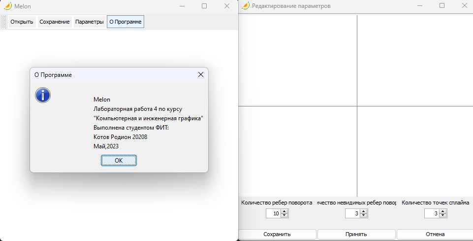
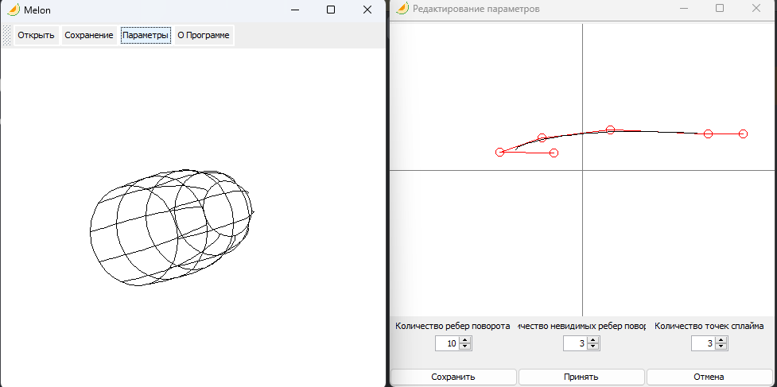

# Plum

<div id="header" align="center">
  
</div>

## Описание

Desktop приложение для отображения фигур вращения с образующей в виде B-сплайна в виде проволочной модели с возможностью управления положением камеры.
## Стек 

```Swing, Kotlin```

## Фичи-лист

- Построение B-сплайна
  - Редактирование кол-ва точек
- Построение проволочной модели
  - Редактирование кол-ва ребер поворота 
  - Редактирование невидимых ребер поворота
- Движение камеры
  - Приближение/Удаление
  - Повороты
- Перспектива

## Интерфейс


## Примеры обработки
 

 